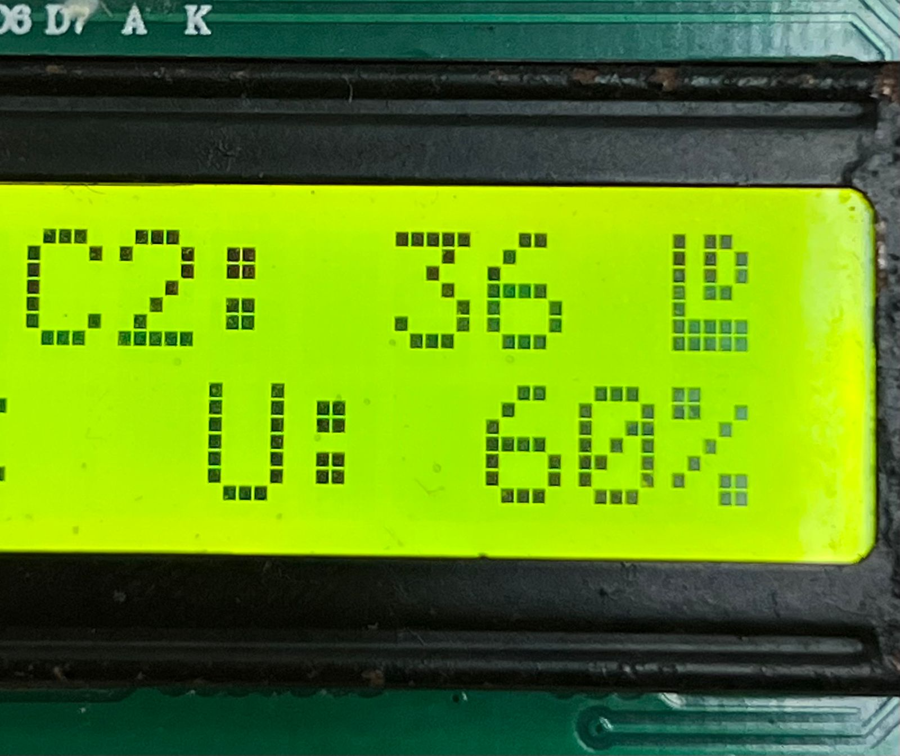

# Universal Test Case — PARAHYBAJA

Modular firmware for ESP32 designed for sensor test campaigns within PARAHYBAJA.  
The core idea is to keep the infrastructure code (SD Card, LCD, button) **intrinsic between tests**, so that only a single file needs to be edited for each new sensor campaign, making it unnecessary to rebuild the entire firmware from scratch.

---

## Required Hardware

| Component | Specification |
|---|---|
| Microcontroller | ESP32 DevKit|
| Display | LCD with I2C module (PCF8574) |
| Storage | SD Card SPI module |
| Input | Push-button |

---

## Pinout — top rail of the ESP32

```
VIN  GND  D13  D12  D14  D27  D26  D25  D33  D32  D35  D34  VN   VP   EN
           |    |    |    |    |         |    |    
          MOSI MISO SCL  CS   B1        SDA  SCL  (LCD I2C)
```

| Signal | GPIO Pin | Label |
|---|---|---|
| SD MOSI | 13 | D13 |
| SD MISO | 12 | D12 |
| SD CLK | 14 | D14 |
| SD CS | 27 | D27 |
| Button B1 | 26 | D26 (GND when pressed) |
| LCD SDA | 32 | D32 |
| LCD SCL | 33 | D33 |

**LCD I2C address:** `0x27` (default). If the display stays blank, try `0x3F` in `PinConfig.h`.

---

## Getting Started

### 1. Prerequisites

- [VS Code](https://code.visualstudio.com/) with the **PlatformIO IDE** extension
- SD card formatted as **FAT32**

### 2. Clone and open

```bash
git clone <repository-url>
```

Open the `modelTests` folder in VS Code. PlatformIO will detect the project automatically.

### 3. First build

```
Ctrl+Shift+P → PlatformIO: Build
```

or via terminal:

```bash
pio run
```

This step is mandatory the first time: it downloads dependencies (including `LiquidCrystal_I2C`) and generates the compilation database used by IntelliSense. Underlined errors in the editor before this step are **false positives** and disappear after the build.

### 4. Flash to ESP32

Connect the ESP32 via USB and press the **Upload** button in PlatformIO, or:

```bash
pio run --target upload
```

### 5. Serial monitor (optional)

```bash
pio device monitor
```

Baudrate: **115200**. Status messages are prefixed with `[CORE]`, `[SD]`.

---

## System Behavior

```
Power on
 │
 ▼
[LCD check] ── OK ──► "LCD OK!"
 │
 ▼
[SD Card check] ── OK ──► "SDCard OK!"
                └─ ERROR ─► "SDCard ERROR!"
 │
 ▼
"Press B1 to start test"
 │
 ▼  (press B1)
[STATE_LOGGING] ─── writes CSV to SD every USER_LOG_INTERVAL_MS
 │                  updates display via UserCode_UpdateDisplay()
 │                  a special character will appear at column 16, row 1, if SD is OK and recording.
 │
 │
 ▼  (press B1 again)
[STATE_IDLE] ─── closes file, clears character, returns to wait screen
```
<div style="text-align: center;">


> Element in the upper-right corner of the display — indicates the SD Card is actively recording.

</div>

## File Structure

```
modelTests/
├── platformio.ini          Project configuration (dependencies, board)
│
├── include/
│   ├── PinConfig.h         ★ Pins and parameters — EDIT for new test
│   ├── CoreModule.h        Core module interface (do not edit)
│   ├── SdModule.h          SD Card module interface (do not edit)
│   └── LcdModule.h         LCD module interface (do not edit)
│
└── src/
    ├── main.cpp            Only calls CoreModule_Init / CoreModule_Update
    ├── CoreModule.cpp      State machine, debounce, timer (do not edit)
    ├── SdModule.cpp        SD Card driver via HSPI (do not edit)
    ├── LcdModule.cpp       LCD I2C driver with custom char (do not edit)
    └── UserCode.cpp        ★ File to be edited between different tests
```

`★` = files the user should edit and modify.

---

## USER CODE Guide

### Concept

Inspired by the `/* USER CODE BEGIN / END */` blocks from the STM32 HAL, the project clearly delimits the editable regions. Code between these markers is preserved between framework updates — everything outside the blocks is infrastructure and must not be modified.

### File 1 — `include/PinConfig.h`

User section (end of file):

```c
// =============================================================
// USER SENSOR PINS — add your pins below this line
// =============================================================
#define PIN_SENSOR_RPM        25   // example: hall encoder
#define PIN_SENSOR_THROTTLE   34   // example: potentiometer

// --- SD Card save rate ---
#define USER_LOG_INTERVAL_MS  100  // 100 ms = 10 samples/s
```

Change `USER_LOG_INTERVAL_MS` to control the logging frequency:

| Value | Rate |
|---|---|
| `10` | 100 samples/s |
| `100` | 10 samples/s |
| `1000` | 1 sample/s |

---

### File 2 — `src/UserCode.cpp`

This is the only file that changes between tests. It has **five USER CODE blocks**:

#### `/* USER CODE BEGIN INCLUDES */`
Include your sensor libraries.

```cpp
/* USER CODE BEGIN INCLUDES */
#include <Wire.h>
#include <Adafruit_BMP280.h>
/* USER CODE END INCLUDES */
```

---

#### `/* USER CODE BEGIN VARIABLES */`
Declare global test variables and objects. Variables declared here are accessible in all functions in the file.

```cpp
/* USER CODE BEGIN VARIABLES */
static Adafruit_BMP280 bmp;
static float temperature = 0.0f;
static int   rpm         = 0;
/* USER CODE END VARIABLES */
```

> **Important:** keep `lastDisplayUpdate` in this block and **do not remove it** — it ensures the display updates immediately when each session starts.

---

#### `UserCode_Setup()` — `/* USER CODE BEGIN SETUP */`
Called **once** during initialization, after the core modules are ready.  
Initialize sensors, configure pins, etc.

```cpp
void UserCode_Setup() {
    /* USER CODE BEGIN SETUP */
    pinMode(PIN_SENSOR_RPM, INPUT);
    bmp.begin(0x76);
    /* USER CODE END SETUP */
}
```

---

#### `UserCode_UpdateDisplay()` — `/* USER CODE BEGIN UPDATE_DISPLAY */`
Called **every loop iteration** while the system is recording.  
You have full control of the display — use `LcdModule_ShowMessage(line0, line1)`.  
Each line supports up to **16 characters** (on line0, column 16 is reserved for the recording indicator).

```cpp
void UserCode_UpdateDisplay(uint32_t elapsedMs) {
    /* USER CODE BEGIN UPDATE_DISPLAY */

    if (elapsedMs - lastDisplayUpdate >= 200) {   // updates every 200 ms
        lastDisplayUpdate = elapsedMs;

        char l0[16], l1[16];
        snprintf(l0, sizeof(l0), "RPM: %4d", rpm);
        snprintf(l1, sizeof(l1), "T:%.1fC U:%.0f%%", temperature, humidity);
        LcdModule_ShowMessage(l0, l1);
    }

    /* USER CODE END UPDATE_DISPLAY */
}
```

---

#### `UserCode_GetCsvHeader()` — `/* USER CODE BEGIN CSV_HEADER */`
Returns the CSV file header. Called **once** when recording starts.  
Must match exactly the columns returned by `UserCode_GetDataRow()`.

```cpp
const char* UserCode_GetCsvHeader() {
    /* USER CODE BEGIN CSV_HEADER */
    return "time_ms,rpm,temperature\n";
    /* USER CODE END CSV_HEADER */
}
```

---

#### `UserCode_GetDataRow()` — `/* USER CODE BEGIN DATA_ROW */`
Returns **one CSV row** per sample. Called every `USER_LOG_INTERVAL_MS`.  
Use `snprintf` into `buf[]` — never allocate dynamic memory here.  
Increase the size of `buf[]` if you have many columns.

```cpp
const char* UserCode_GetDataRow(uint32_t timestampMs) {
    static char buf[128];
    /* USER CODE BEGIN DATA_ROW */
    snprintf(buf, sizeof(buf), "%lu,%d,%.2f\n",
        (unsigned long)timestampMs,
        rpm,
        temperature
    );
    /* USER CODE END DATA_ROW */
    return buf;
}
```

---

#### `UserCode_Stop()` — `/* USER CODE BEGIN STOP */`
Called **once** when the button ends the recording session.  
Reset variables to their initial state so the next session starts fresh.

```cpp
void UserCode_Stop() {
    /* USER CODE BEGIN STOP */
    rpm                = 0;
    temperature        = 0.0f;
    lastDisplayUpdate  = (uint32_t)(-1000UL);  // always keep this line
    /* USER CODE END STOP */
}
```

> **Always keep** the `lastDisplayUpdate` reset in `UserCode_Stop()`. Without it, the display will take 1 second to appear at the start of the next session.

---

## Checklist for a New Test

```
[ ] 1. Add new sensor pins in PinConfig.h (USER section)
[ ] 2. Adjust USER_LOG_INTERVAL_MS according to test dynamics
[ ] 3. In UserCode.cpp:
        [ ] INCLUDES  — add sensor libraries
        [ ] VARIABLES — declare objects and variables
        [ ] SETUP     — initialize sensors (begin, pinMode)
        [ ] CSV_HEADER — define column names
        [ ] DATA_ROW  — read sensors and format CSV row
        [ ] UPDATE_DISPLAY — format what appears on the LCD
        [ ] STOP      — reset variables + lastDisplayUpdate
[ ] 4. pio run (compile and check for errors)
[ ] 5. Insert SD Card formatted as FAT32
[ ] 6. Upload and test
```

---

## Files Generated on the SD Card

Each recording session creates a new file:

```
/log_0001.csv
/log_0002.csv
/log_0003.csv
...
```

The index increments automatically — no session overwrites another.

---

## Dependencies

Declared in `platformio.ini` — installed automatically by PlatformIO:

| Library | Usage |
|---|---|
| `marcoschwartz/LiquidCrystal_I2C` | LCD I2C display driver |
| `SD` | SD Card driver (included in ESP32 core) |
| `SPI` | SPI bus for SD (included in ESP32 core) |
| `Wire` | I2C bus for LCD (included in ESP32 core) |
